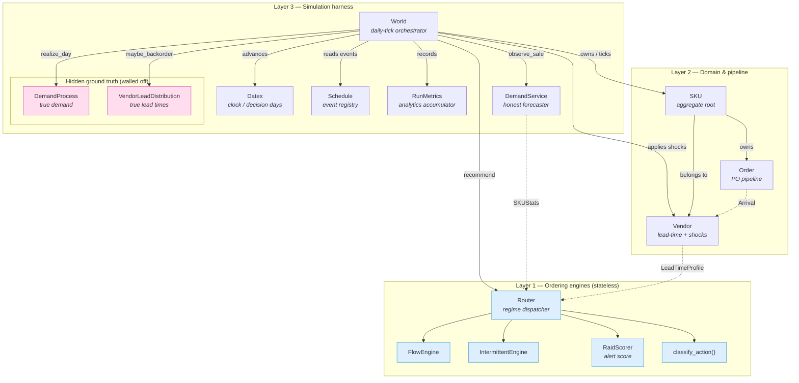
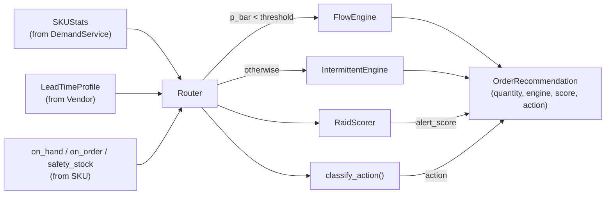
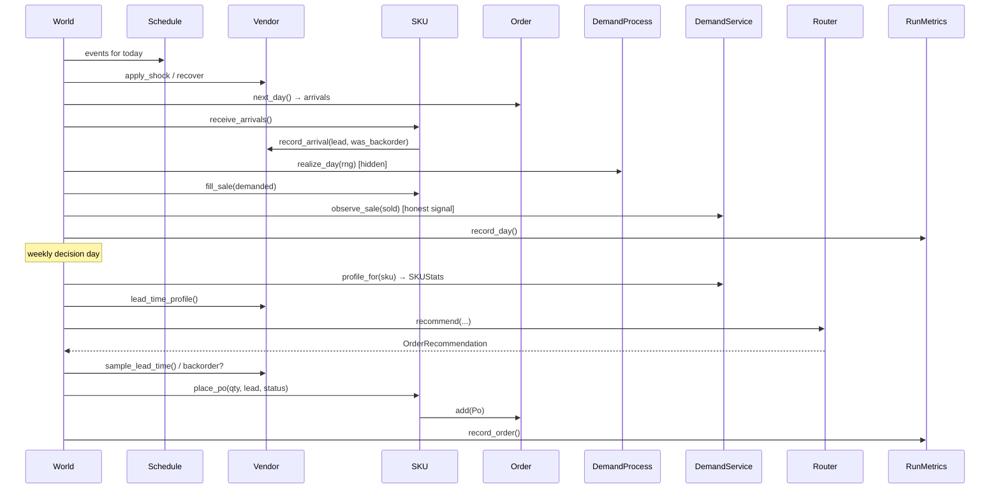
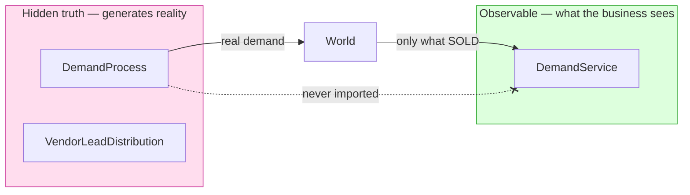

# InventoryX — Services Concept Map

A map of the "services" in InventoryX and how they relate to one another.
InventoryX is a pure-logic Python library organized in **three independently
testable layers**:

1. **Engines** (`inventoryx/inventory_engines.py`) — stateless ordering math.
2. **Domain** (`inventoryx/entities.py`, `inventoryx/pipeline.py`) — mutable
   inventory objects: SKUs, vendors, and the purchase-order pipeline.
3. **Simulation** (`inventoryx/simulation/`) — a discrete-event harness that
   drives the domain through the engines, against a hidden ground truth.

A deliberate isolation boundary runs through the simulation layer: the
**forecaster** (`DemandService`) observes only realized *sales*, while the
hidden **truth** (`DemandProcess`, `VendorLeadDistribution`) generates the
real demand and lead times. The forecaster never imports truth — a separation
enforced by a test — so engines must react to lagged, honest signals.

---

## 1. High-level concept map

---

## 2. Service catalog

| Service | Layer | File | Role |
|---|---|---|---|
| **Router** | Engines | `inventory_engines.py` | Picks an engine per SKU on inter-arrival time (`p_bar`); assembles the recommendation. |
| **FlowEngine** | Engines | `inventory_engines.py` | Order quantity for high-frequency demand (root-find `find_g` via `scipy.brentq`). |
| **IntermittentEngine** | Engines | `inventory_engines.py` | Croston/SBA reorder point + safety stock for lumpy demand. |
| **RaidScorer** | Engines | `inventory_engines.py` | Cross-cutting alert score; per-shipment pipeline-health trace (`raid_items`). |
| **classify_action** | Engines | `inventory_engines.py` | Maps (score, qty) → `OVERSTOCKED / BALANCED / REORDER / URGENT`. |
| **SKU** | Domain | `entities.py` | Aggregate root: on-hand stock, safety stock, owns its `Order`, places POs. |
| **Vendor** | Domain | `entities.py` | Lead-time distribution + shock state; learns realized lead times. |
| **Order** | Pipeline | `pipeline.py` | Per-SKU PO pipeline; advances time; emits `Arrival` records. |
| **DemandService** | Simulation | `simulation/demand_service.py` | Honest forecaster over a rolling window of *sold* units → `SKUStats`. |
| **World** | Simulation | `simulation/world.py` | Daily-tick orchestrator wiring every other service together. |
| **Schedule** | Simulation | `simulation/events.py` | Day-indexed registry of vendor shocks and demand spikes. |
| **RunMetrics** | Simulation | `simulation/metrics.py` | Per-SKU + per-engine fill-rate / holding-cost accumulator. |
| **Datex** | Simulation | `simulation/clock.py` | Time authority; flags weekly decision days. |
| **DemandProcess** | Truth | `simulation/truth.py` | Hidden true per-SKU demand generator. |
| **VendorLeadDistribution** | Truth | `simulation/truth.py` | Hidden true per-vendor lead-time generator / backorder injector. |

---

## 3. The Router → engines relationship

The `Router` is the single decision service. It is **stateless** and composes
the two engines plus the scorer. Wiring is constructor injection (no DI
container), so any part can be swapped for a test double.

---

## 4. World orchestration — who calls whom each tick

`World` is the hub. Per day it advances the pipeline, realizes hidden demand,
feeds the forecaster only what *sold*, and weekly asks the `Router` what to
order. The truth services sit behind the dashed isolation line.

---

## 5. The isolation boundary (key invariant)

`DemandService` records **sold** units, not **demanded** units — an upstream
POS can't see lost sales it never rang up. During stockouts and shocks the
forecaster therefore lags the truth, and the engines must cope. The boundary
is enforced by `test_demand_service_does_not_import_truth`.

---

## 6. Data objects passed between services

| Object | Produced by | Consumed by |
|---|---|---|
| `SKUStats` | `DemandService.profile_for` | `Router`, `FlowEngine`, `IntermittentEngine`, `RaidScorer` |
| `LeadTimeProfile` | `Vendor.lead_time_profile` | `Router` and engines |
| `OrderRecommendation` | `Router.recommend` | `World._decide` |
| `Po` | `SKU.place_po` → `Order.add` | `Order` pipeline |
| `Arrival` | `Order.next_day` | `SKU.receive_arrivals` → `Vendor.record_arrival` |
| `Shock` | `World._apply_events_for_today` | `Vendor.apply_shock` |

---

*Generated for branch `claude/services-concept-map-xXdNH`. Source of truth:
`inventoryx/` — see `docs/DESIGN.md` for architectural rationale.*
